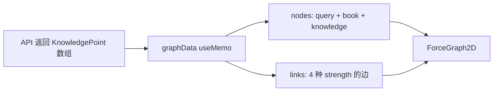
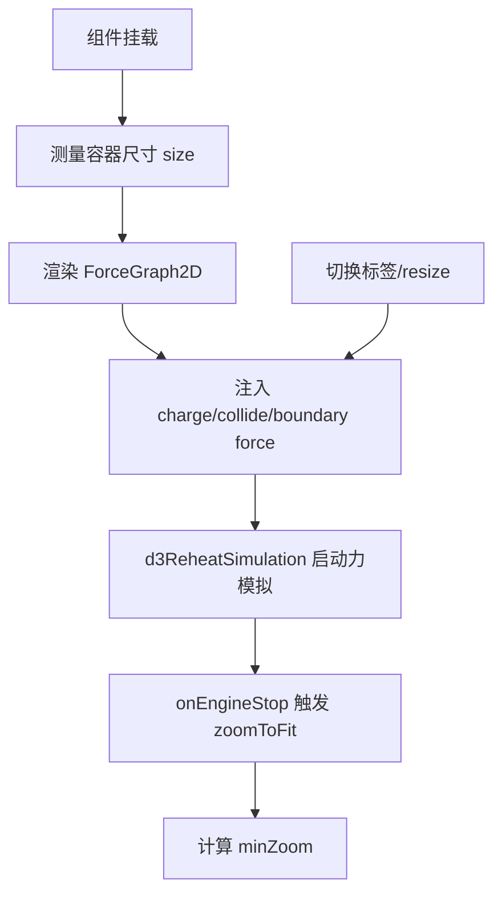

# 妙读知识图谱技术白皮书

> 文档目标：系统记录当前网络图（力导向知识图谱）的核心原理、架构设计、技术实现细节及复用路径，供后续项目直接参考。

---

## 目录

1. [概述](#1-概述)
2. [网络拓扑结构](#2-网络拓扑结构)
3. [数据流转机制](#3-数据流转机制)
4. [核心算法原理](#4-核心算法原理)
5. [关键技术组件](#5-关键技术组件)
6. [接口规范](#6-接口规范)
7. [性能参数与优化](#7-性能参数与优化)
8. [应用场景与复用路径](#8-应用场景与复用路径)
9. [术语表](#9-术语表)
10. [附录：核心代码示例](#10-附录核心代码示例)

---

## 1. 概述

### 1.1 目标与定位

本知识图谱用于在“妙读”电子书拆解平台中，将**知识点搜索结果**以网络图形式可视化。它把用户搜索词、相关书籍、书籍下知识点抽象为节点，把“属于”“父子”“同章节相邻”等关系抽象为边，帮助用户快速理解知识分布与关联。

### 1.2 核心能力

- **三级层级结构**：搜索词 → 书籍 → 知识点。
- **力导向布局**：节点在斥力、引力、边界约束下自动排布。
- **标签智能显隐**：仅控制第三层知识点标签，搜索词与书籍标签始终可见。
- **自适应容器**：根据容器尺寸计算边界，窗口 resize 后防抖重排。
- **防过度缩小**：动态最小缩放阈值，保证文字可读。
- **Canvas 高性能渲染**：单画布绘制节点、连线与标签，支持数百节点流畅交互。

### 1.3 适用范围

- 前端项目：`miaodu/frontend`
- 核心组件：[`miaodu/frontend/src/components/KnowledgeGraph.jsx`](file:///Users/yq/Documents/zhihr/miaodu/frontend/src/components/KnowledgeGraph.jsx)
- 依赖后端接口：`/api/knowledge/search`
- 主要依赖库：`react-force-graph-2d`、`d3-force-3d`

---

## 2. 网络拓扑结构

### 2.1 三级层级模型

```text
                    ┌─────────────────┐
                    │   搜索词节点     │  ← 第一层（固定中心）
                    │  type: query    │
                    └────────┬────────┘
                             │ strength=4
         ┌───────────────────┼───────────────────┐
         │                   │                   │
    ┌────▼────┐         ┌────▼────┐         ┌────▼────┐
    │ 书籍节点 │         │ 书籍节点 │  ...   │ 书籍节点 │  ← 第二层
    │type:book│         │type:book│         │type:book│
    └────┬────┘         └────┬────┘         └────┬────┘
         │ strength=1        │                   │
    ┌────▼────┐         ┌────▼────┐         ┌────▼────┐
    │ 知识点  │         │ 知识点  │  ...   │ 知识点  │  ← 第三层
    │type:know│         │type:know│         │type:know│
    └─────────┘         └─────────┘         └─────────┘
```

### 2.2 节点与边类型

| 层级 | 节点类型 | ID 规则 | 固定属性 | 说明 |
|------|----------|---------|----------|------|
| 1 | `query` | `query-center` | `fx=0, fy=0` | 搜索词，绝对中心 |
| 2 | `book` | `book-{book_id}` | 无 | 相关书籍，按书籍 ID 取色 |
| 3 | `knowledge` | `kp-{id}` | 无 | 知识点，继承对应书籍颜色 |

| 边类型 | `strength` | `linkDistance` | 含义 |
|--------|------------|----------------|------|
| 搜索词 → 书籍 | 4 | 180 | 核心关联，最粗最显眼 |
| 书籍 → 知识点 | 1 | 95（显标签）/ 70（隐标签） | 归属关系 |
| 知识点父 → 子 | 3 | 55 | 层级父子关系 |
| 同章节知识点链 | 2 | 75（显标签）/ 55（隐标签） | 顺序关系，弱化显示 |

### 2.3 视觉编码

- **颜色**：书籍与知识点使用同一套 10 色盘，按 `book_id % 10` 取色。
- **大小**：`val` 决定节点半径，`radius = sqrt(val) * 3.5`。
- **描边**：搜索词描边最粗（3px），书籍次之（2px），知识点无描边。
- **标签**：搜索词字号 16px 加粗置顶；书籍字号 12px 加粗，径向 outward 布局；知识点字号 10px，默认置底，可显隐。

---

## 3. 数据流转机制

### 3.1 数据源与后端查询

后端使用 D1 数据库，知识点搜索接口返回知识点及其所属书籍信息：

```sql
SELECT kp.*, b.title AS book_title, b.author AS book_author
FROM miaodu_knowledge_points kp
JOIN miaodu_books b ON kp.book_id = b.id
WHERE kp.title LIKE ? OR kp.content LIKE ?
ORDER BY kp.book_id, kp.sort_order
```

参数化绑定避免 SQL 注入。

### 3.2 前端数据转换



构建流程：

1. 创建 `query` 节点并固定于原点。
2. 去重生成 `book` 节点，按角度均匀分布在半径 120 的内环。
3. 遍历知识点生成 `knowledge` 节点，按书籍分组后分布在对应书籍扇区的外环。
4. 添加书籍→知识点、父子知识点、同章节知识点链三类边。

### 3.3 组件生命周期



---

## 4. 核心算法原理

### 4.1 力导向布局

组件基于 `react-force-graph-2d`，底层使用 `d3-force`。自定义的力包括：

| 力 | 作用 | 配置 |
|----|------|------|
| `charge` | 节点间斥力 | query -400、book -200、knowledge 根据标签显隐 -80/-40 |
| `collide` | 防止节点/标签重叠 | 半径来自 `getNodeRadius`，strength 0.7，iterations 2 |
| `boundary` | 自定义边界约束 | 将越界节点以 alpha*0.5 的柔和速度推回 |
| `center` | 默认中心力 | 已移除，避免与边界约束冲突 |

### 4.2 初始扇区布局

为避免力模拟从随机位置开始导致的视觉混乱，节点初始化位置采用**层级扇区布局**：

- 书籍节点均匀分布在半径 120 的圆上，起始角度 `-π/2`（正上方）。
- 每本书对应的知识点分布在以该书籍角度为中心的扇区内，扇区跨度为 `min(angleStep * 0.8, π/2.5)`。
- 知识点半径 `230 + level * 22`，层级越高（数值越小）越靠近中心。

### 4.3 边界约束

边界尺寸根据容器大小与节点数量动态计算：

```js
function computeNominalBounds(nodeCount, containerWidth, containerHeight) {
  const baseW = Math.max(containerWidth || 800, 640)
  const baseH = Math.max(containerHeight || 600, 480)
  const scale = 1 + Math.sqrt(Math.max(0, nodeCount - 15)) * 0.10
  return { width: baseW * scale, height: baseH * scale }
}
```

`maxRadius = min(width, height) / 2 * 0.92`。自定义 `forceBoundary` 对超出边界的节点施加径向向内的速度修正。

### 4.4 碰撞检测

碰撞半径不是固定圆半径，而是**标签感知半径**：

```js
function getNodeRadius(node, showKnowledgeLabels) {
  const baseR = Math.sqrt(Math.max(1, node.val || 1)) * 3.5
  const labelW = node.__labelWidth || 0
  if (node.type === 'query') return Math.max(baseR, labelW / 2, 10) + 8
  if (node.type === 'book') return Math.max(baseR, labelW / 2, 8) + 6
  if (!showKnowledgeLabels) return baseR + 4
  return Math.max(baseR, labelW / 2, 6) + 6
}
```

标签宽度通过离屏 Canvas `measureText` 精确测量，节点对象上缓存 `__labelWidth` 与 `__radius`。

### 4.5 动态缩放与适配

- 力模拟停止后调用 `zoomToFit(400, 20)`，400ms 动画、20px 边距。
- 根据当前缩放 `z` 计算 `minZoom = clamp(min(z, MIN_READABLE), MIN_ZOOM_FLOOR, 1)`。
- `MIN_READABLE=0.7` 限制手动缩小时文字不低于 70%；`MIN_ZOOM_FLOOR=0.25` 是绝对下限。
- 窗口 resize 后通过 200ms 防抖再更新边界并重排，避免连续抖动。

---

## 5. 关键技术组件

### 5.1 react-force-graph-2d

- 负责 Canvas 初始化、d3-zoom 交互、力模拟调度。
- 提供 `d3Force(name, force)` 注册/覆盖自定义力，`d3ReheatSimulation()` 重新加热，`zoomToFit`、`centerAt`、`zoom` 等视图方法。
- 通过 `nodeCanvasObject` 自定义节点绘制，通过 `linkWidth`、`linkDistance`、`linkColor` 自定义边。

### 5.2 d3-force-3d

- 仅引入 `forceCollide` 用于 2D 碰撞检测（3D 版本在二维场景下同样可用）。
- 碰撞半径支持函数回调，可动态响应标签显隐状态。

### 5.3 Canvas 渲染

- 所有节点与标签在同一 Canvas 绘制，性能远高于 DOM。
- 标签绘制顺序：先画白底圆角背景，再写文字，确保连线被背景覆盖，实现“无交叉”视觉效果。
- 书籍标签采用径向 outward 布局：根据节点相对中心的角度决定标签位于左/右/上/下。

### 5.4 React Hooks

| Hook | 职责 |
|------|------|
| `useState` | `selectedNode`、`showKnowledgeLabels`、`size`、`minZoom` |
| `useRef` | `fgRef`、`wrapperRef`、`fitDoneRef`、`fitGenerationRef`、`resizeTimeoutRef`、`forceConfigRef` |
| `useMemo` | `graphData` 构建与缓存 |
| `useEffect` | 容器尺寸监听、力配置与防抖 resize |
| `useCallback` | `nodeCanvasObject`、`linkDistance`、`linkWidth`、`handleEngineStop` 等 |

---

## 6. 接口规范

### 6.1 后端 API

**GET** `/api/knowledge/search?q={keyword}`

返回示例：

```json
{
  "found": true,
  "data": [
    {
      "id": 1,
      "book_id": 10,
      "book_title": "非暴力沟通",
      "book_author": "马歇尔·卢森堡",
      "chapter": "第一章",
      "level": 2,
      "title": "观察与评论的区别",
      "content": "...",
      "parent_id": 0,
      "sort_order": 1
    }
  ]
}
```

### 6.2 组件 Props

```ts
interface KnowledgeGraphProps {
  results: KnowledgePoint[]   // 搜索结果数组
  query: string               // 当前搜索词
  onViewBook?: (bookTitle: string) => void  // 点击书籍节点回调
}
```

### 6.3 节点/边数据模型

节点内部字段：

```ts
interface GraphNode {
  id: string
  label: string
  type: 'query' | 'book' | 'knowledge'
  val: number
  color: string
  x?: number
  y?: number
  fx?: number   // 固定坐标
  fy?: number
  // 运行时缓存
  __text: string
  __fontSize: number
  __fontWeight: string
  __labelWidth: number
  __radius?: number
  __showLabels?: boolean
}

interface GraphLink {
  source: string
  target: string
  value: number
  strength: 1 | 2 | 3 | 4
  color: string
}
```

---

## 7. 性能参数与优化

### 7.1 默认参数

| 参数 | 值 | 说明 |
|------|-----|------|
| `warmupTicks` | 60 | 初始预热步数，让布局更快稳定 |
| `cooldownTicks` | 120 | 冷却步数上限 |
| `d3VelocityDecay` | 0.38 | 速度衰减系数，越大布局越快稳定 |
| `collide.strength` | 0.7 | 碰撞强度 |
| `collide.iterations` | 2 | 每步碰撞迭代次数 |
| `maxZoom` | 10 | 最大缩放 |
| `MIN_READABLE` | 0.7 | 可读缩放上限 |
| `MIN_ZOOM_FLOOR` | 0.25 | 最小缩放下限 |

### 7.2 大规模数据策略

- 当 `results.length > 300` 时，界面右上角提示“已启用 Canvas 渲染保证流畅性”。
- 边界尺寸按 `sqrt(nodeCount - 15) * 0.10` 扩展，避免节点过密。
- 知识点标签隐藏时，碰撞半径减小、链路距离缩短，可显著降低视觉密度。
- 后端接口已设置 `LIMIT`（工程约定：知识点搜索 30 条），从源头控制数据量。

### 7.3 测量与缓存

- 离屏 Canvas 在模块级创建一次，避免重复创建。
- `__labelWidth`、`__radius` 在节点对象上缓存，力模拟每帧不再重复测量。
- `graphData` 仅在 `results` 或 `query` 变化时重建；切换标签只更新力参数，不重建数据。

---

## 8. 应用场景与复用路径

### 8.1 妙读电子书拆解（当前场景）

- 搜索词作为核心主题，书籍为关联载体，知识点为具体内容。
- 已落地，直接可用。

### 8.2 论文/文献知识网络

**适配改造**：
- 第一层：研究主题/关键词。
- 第二层：论文/作者/期刊。
- 第三层：研究方法、数据集、结论。
- 边类型：引用、共现、同属主题。

**实现路径**：
- 修改后端查询，返回 `paper_id`、`paper_title`、`author`、`keyword` 等字段。
- 调整 `graphData` 构建逻辑，按论文分组知识点。
- 颜色可按研究领域或年份映射。

### 8.3 技能/课程图谱

**适配改造**：
- 第一层：技能方向（如“前端开发”）。
- 第二层：课程/项目。
- 第三层：知识点/技能点。
- 边类型：前置依赖、包含关系。

**实现路径**：
- 增加 `prerequisite` 字段，用于生成父子/依赖边。
- 在 `nodeCanvasObject` 中为技能点添加熟练度颜色映射。

### 8.4 企业知识库

**适配改造**：
- 第一层：业务领域/问题。
- 第二层：文档/系统/产品。
- 第三层：FAQ、条款、操作步骤。
- 边类型：引用、相关、同标签。

**实现路径**：
- 后端接入文档检索服务（如 Elasticsearch）。
- 增加标签聚类逻辑，按标签分组生成第二层节点。
- 节点点击可打开文档详情或跳转到原文。

### 8.5 复用改造清单

| 改造项 | 需要修改的文件/位置 | 工作量 |
|--------|---------------------|--------|
| 后端查询 SQL | `backend/src/db.ts` | 中 |
| 节点/边构建逻辑 | `frontend/src/components/KnowledgeGraph.jsx` 的 `graphData` | 中 |
| 颜色/大小映射 | `BOOK_COLORS`、`getBookColor`、`nodeCanvasObject` | 小 |
| 标签显隐规则 | `showKnowledgeLabels` 与 `nodeCanvasObject` 条件 | 小 |
| 交互弹窗内容 | `selectedNode` 渲染块 | 小 |
| 层级数量扩展 | 修改 `graphData` 与半径/距离公式 | 中 |

---

## 9. 术语表

| 术语 | 解释 |
|------|------|
| 力导向图（Force-directed Graph） | 通过模拟物理力（斥力、引力）自动计算节点位置的图布局算法 |
| d3-force | D3 提供的力模拟库，`react-force-graph-2d` 的底层依赖 |
| 节点（Node） | 图中的实体，如搜索词、书籍、知识点 |
| 边（Link） | 节点间的关系，如“属于”“父子”“同章节” |
| 边界约束（Boundary Constraint） | 自定义力，防止节点飞出指定区域 |
| 碰撞检测（Collision Detection） | 防止节点或标签相互覆盖的物理模拟 |
| zoomToFit | 自动调整视图缩放与中心，使全部节点可见 |
| Canvas 渲染 | 使用 HTML5 Canvas API 绘制图形，性能高于 DOM |
| 防抖（Debounce） | 延迟执行高频事件处理函数，减少重复计算 |

---

## 10. 附录：核心代码示例

### 10.1 节点与边构建

```jsx
const graphData = useMemo(() => {
  if (!results?.length || !query) return { nodes: [], links: [] }

  const nodes = []
  const links = []
  const bookMap = new Map()
  const kpMap = new Map()

  // 第一层：搜索词中心节点
  nodes.push({
    id: 'query-center',
    label: query,
    type: 'query',
    val: 24,
    color: '#1f2937',
    fx: 0,
    fy: 0,
  })

  // 第二层：书籍节点
  for (const item of results) {
    if (!item.book_id || bookMap.has(item.book_id)) continue
    const bookNode = {
      id: `book-${item.book_id}`,
      label: item.book_title,
      type: 'book',
      bookId: item.book_id,
      val: 14,
      color: getBookColor(item.book_id),
    }
    bookMap.set(item.book_id, bookNode)
    nodes.push(bookNode)
  }

  // 第三层：知识点节点与边
  for (const item of results) {
    const kpNode = {
      id: `kp-${item.id}`,
      label: item.title,
      type: 'knowledge',
      bookId: item.book_id,
      val: Math.max(3, 8 - (item.level || 3)),
      color: getBookColor(item.book_id),
    }
    kpMap.set(item.id, kpNode)
    nodes.push(kpNode)

    links.push({
      source: `book-${item.book_id}`,
      target: kpNode.id,
      value: 1,
      strength: 1,
      color: 'rgba(150, 150, 150, 0.25)',
    })
  }

  return { nodes, links }
}, [results, query])
```

### 10.2 力配置

```jsx
useEffect(() => {
  if (!fgRef.current || !graphData.nodes.length) return
  const fg = fgRef.current

  fg.d3Force('charge').strength((n) => {
    if (n.type === 'query') return -400
    if (n.type === 'book') return -200
    return showKnowledgeLabels ? -80 : -40
  })

  fg.d3Force(
    'collide',
    forceCollide((n) => n.__radius ?? getNodeRadius(n, showKnowledgeLabels))
      .strength(0.7)
      .iterations(2)
  )

  const nominal = computeNominalBounds(graphData.nodes.length, size.width, size.height)
  const maxRadius = (Math.min(nominal.width, nominal.height) / 2) * 0.92
  fg.d3Force('boundary', forceBoundary(maxRadius, 24))
  fg.d3Force('center', null)

  fg.d3ReheatSimulation()
}, [graphData, showKnowledgeLabels, size.width, size.height])
```

### 10.3 自定义节点绘制

```jsx
const nodeCanvasObject = useCallback((node, ctx) => {
  const radius = Math.sqrt(Math.max(1, node.val || 1)) * 3.5
  ctx.beginPath()
  ctx.arc(node.x, node.y, radius, 0, 2 * Math.PI, false)
  ctx.fillStyle = node.color
  ctx.fill()

  if (node.type === 'book' || node.type === 'query') {
    ctx.strokeStyle = 'rgba(0,0,0,0.12)'
    ctx.lineWidth = node.type === 'query' ? 3 : 2
    ctx.stroke()
  }

  if (node.type !== 'knowledge' || showKnowledgeLabels) {
    const text = node.__text
    ctx.font = `${node.__fontWeight} ${node.__fontSize}px system-ui, -apple-system, sans-serif`
    const textW = ctx.measureText(text).width
    const textH = node.__fontSize

    // 白底圆角背景
    ctx.save()
    ctx.fillStyle = 'rgba(255,255,255,0.92)'
    const bgW = textW + 8
    const bgH = textH + 4
    ctx.beginPath()
    ctx.roundRect(node.x - bgW / 2, node.y + radius + 2, bgW, bgH, 4)
    ctx.fill()
    ctx.restore()

    ctx.fillStyle = '#374151'
    ctx.textAlign = 'center'
    ctx.fillText(text, node.x, node.y + radius + 4)
  }
}, [showKnowledgeLabels])
```

### 10.4 边界约束实现

```jsx
function forceBoundary(maxRadius, padding = 20) {
  let nodes
  function force(alpha) {
    for (const n of nodes) {
      if (n.fx != null || n.fy != null) continue
      const r = Math.hypot(n.x, n.y)
      const nodeR = n.__radius ?? getNodeRadius(n, n.__showLabels ?? true)
      const limit = Math.max(0, maxRadius - padding - nodeR)
      if (r > limit) {
        const angle = Math.atan2(n.y, n.x)
        const k = alpha * 0.5
        n.vx = (n.vx || 0) + (limit * Math.cos(angle) - n.x) * k
        n.vy = (n.vy || 0) + (limit * Math.sin(angle) - n.y) * k
      }
    }
  }
  force.initialize = (n) => { nodes = n }
  return force
}
```

---

## 结语

本白皮书覆盖了妙读知识图谱从数据查询、前端转换、力模拟布局到 Canvas 渲染的完整链路。后续若要在新场景中复用，核心只需替换 `graphData` 构建逻辑与后端查询，即可快速搭建具备层级结构、自适应布局与交互能力的网络图。
